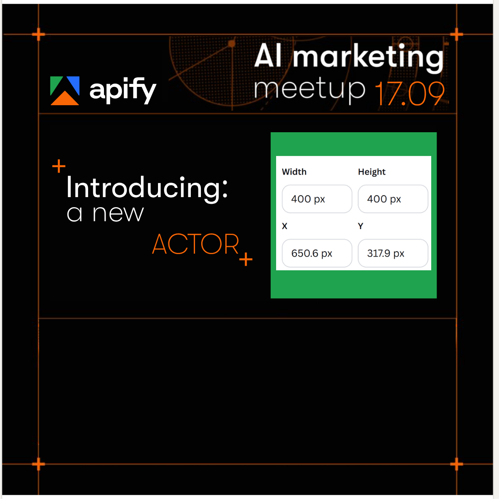
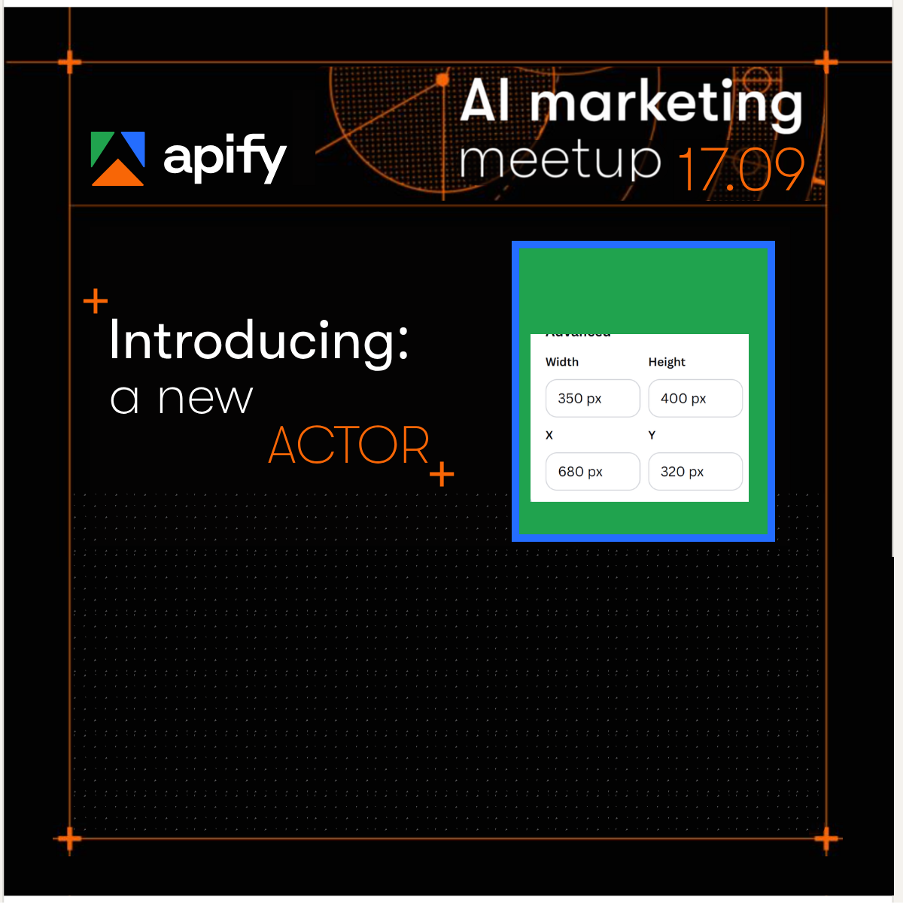
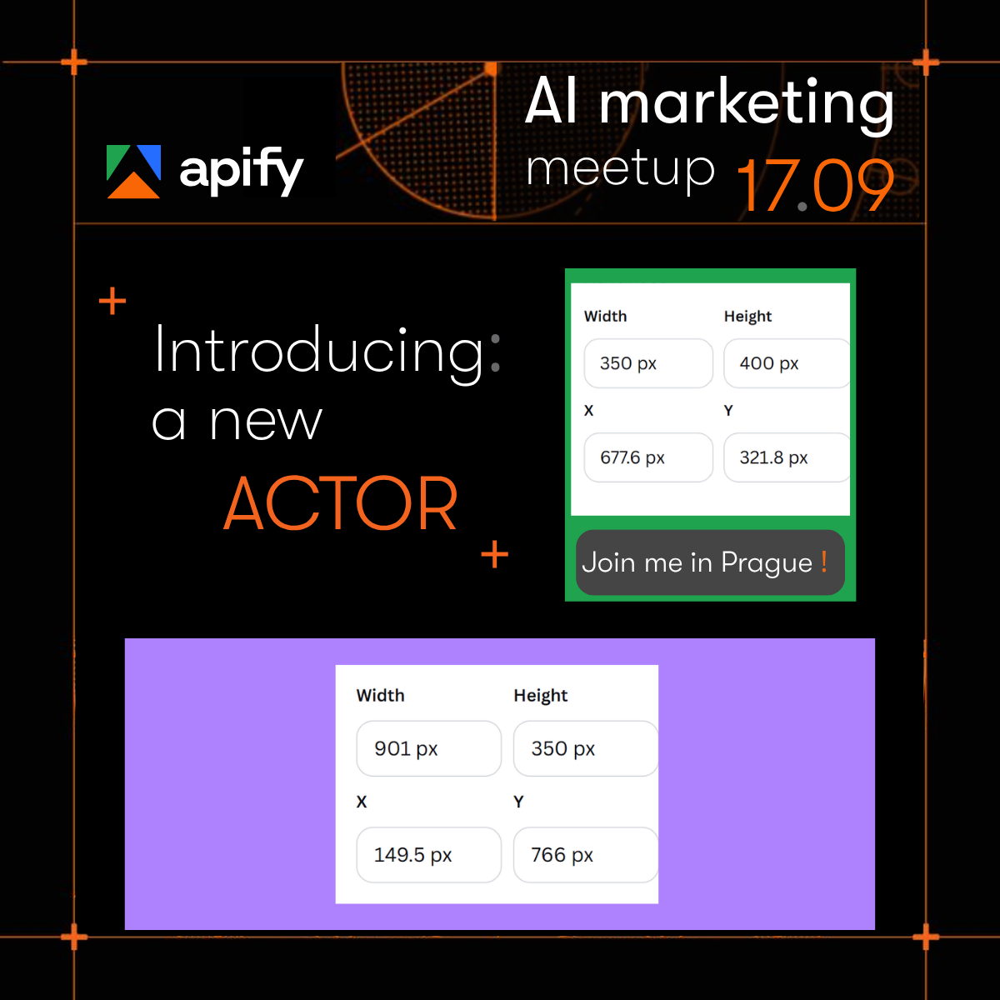

# The template: one canon image, eight fixed constants

The pipeline composites into exactly one background:
[`speaker-teaser-linkedin_v4.png`](../../_internal/core-templates-please-dont-touch/speaker-teaser-linkedin_v4.png),
1200×1200, **final for this demo**. It is not a design export. It is
**machine-built** (2026-09-01): a baked gradient starfield, a purple
block where the actor card lands, a green block where the speaker
element lands — drawn at the operator's locked layout, superseding the
original hand-composed Canva teaser. v4 (2026-09-07) is v3 renumbered
pixel for pixel so the image and the intake form carry one version
number.

## The eight numbers

Both blocks were measured **once**, at build time, as exact-colour
footprints (`#AE81FF`, `#20A34E`) in whole pixels — taking the dense
rectangle rather than a raw bounding box, so the Apify logo's green in
the header cannot widen the read. The result is frozen in §6 of the
[intake form](../../_internal/core-templates-please-dont-touch/intake-template.md):

| block | placeholder | fixed geometry (v4) | frontmatter keys |
|---|---|---|---|
| actor card | purple `#AE81FF` | 799×307 @ (201, 748) | `card_x/y/w/h` |
| speaker element | green `#20A34E` | 294×336 @ (706, 345) | `speaker_x/y/w/h` |

A run reads those eight values verbatim and plugs them into the render
page. It never measures the image — a colour mask is unreliable by
construction, since a company logo can share the purple and the header
shares the green. They are also inputs the operator never touches: step 1
of processing **reverts any hand edit** to the frontmatter back to the
template before anything renders. The design-time intent was half-pixel
(green @ 705.5, purple @ 200.5); the rendered PNG's edges land on whole
pixels, and whole pixels are what §6 records.

## The one thing re-checked per run

The card's height is quantised in 16px steps and cannot be stretched, so
the block has to be able to hold it. From
[the skill](../../_internal/skills/apify-speaker-card.md), step 4:

```
scale     = card_w / card_width          (card_width default 400)
implied_h = card_h / scale
require |implied_h - actual_h| <= 2px    # else HALT
```

Worked against v4: `scale = 799/400 = 1.9975`, `implied_h =
307/1.9975 = 153.69`, against an actual 153.667 for a two-line
description. Passes. With the geometry fixed, this only trips when
`desc_lines` or `card_width` has been changed, or a blurb renders one
line instead of two — and then the run halts and reports the height the
block would need. Never stretch, letterbox or crop the card to fit.

## Changing the template

A deliberate, versioned event, never a re-save: bump the image's `_v<N>`
suffix and every reference to it, re-measure both blocks the same way,
write the new eight numbers into §6, bump the form's `version` /
`versioned_at`, refresh the two filled copies, then render one card to
confirm both blocks are covered to their last edge pixel.

Re-exporting the background also means re-staging the starfield, not
just dropping in a new PNG: take `_internal/render/particles.svg`
(apify.com's 80×80 particle tile), recolour to `#D2D3D6` with its
authored `opacity .4` dropped, apply a vertical opacity gradient —
100% at the bottom frame line fading to 25% at y=269 — and stamp it onto
background pixels only, inside the orange frame margins. Full recipe:
[the core-templates README](../../_internal/core-templates-please-dont-touch/README.md).

## How the template evolved


**The target.** The finished teaser the pipeline produces today — header
band, speaker element top right, actor card below (the bundled demo
speaker's delivered render).


**First block layout.** One green 400×400 block at X 650.6 / Y 317.9,
the Canva panel left in the image as the record. No card block yet, no
starfield — the lower half is empty frame lines.



**Operator redrafts** — commits `5db0980` → `f981814` and `14dbec7` →
`5273c47`: a fresh draft, then the same treatment each time (bottom
clock out, apify.com particle starfield in, divider gone). The block is
now 350×400 @ (680, 320) with a blue selection border, and the particle
field fills the lower box.


**The locked layout, still hand-made.** Green 350×400 @ (677.6, 321.8)
with a grey "Join me in Prague!" pill below it, purple 901×350 @
(149.5, 766) for the card. The last version before the rebuild — and
before the blocks settled at the numbers in the table above.


**First render into the blocks.** Dashed placeholder outlines stand in
for both images, the slug still carries a bare slash, the footer stats
are in the wrong slots, and the orange circle artwork bleeds out past
the card's edges — the geometry was landing before the content was.

Back to the [index](INDEX.md).
