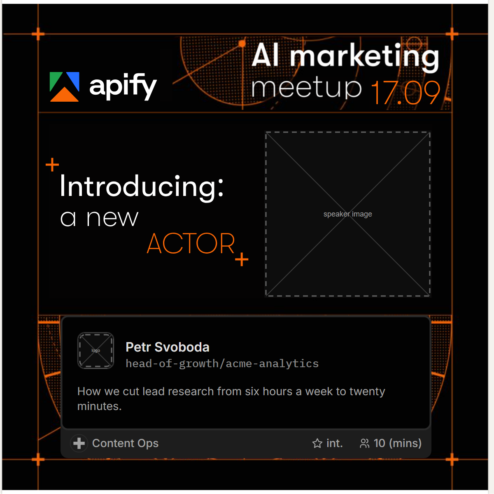
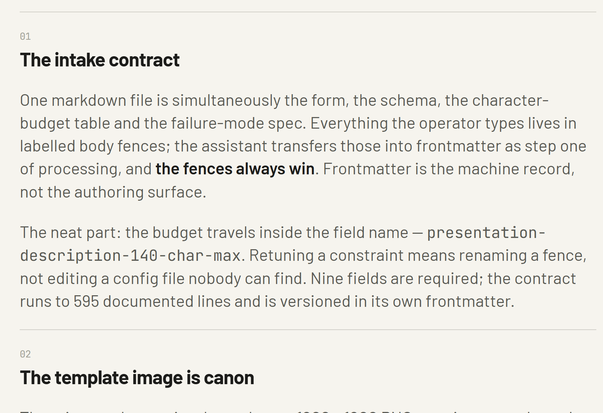

# Timeline: how the docs and the stress test shaped it

Seventeen days, a few dozen commits, no build system. Every phase below is
a real range in `git log`; the pattern across all of them is the same —
each time the docs got stressed, the contract got tighter.

## 1 · First cut — 2026-08-31 (`adb11ed` → `5a8ad80`)

Skill, input contract, canon template and the verified reproduction of
apify.com's actor card landed in one commit. Then the splits: `Start Here`
for humans with gap-filling `NN` numbering (`8b42d55`), a full asset map
and per-folder routing (`b8cc426`), **fenced operator inputs** plus the
duration/level footer fix (`78e4d00`), and the field-mapping doc split into
card mapping and text budgets as separate HTML/PNG pairs (`5a8ad80`).
Skills became visible plain markdown, runnable by any assistant and any
Chromium (`26e758b`, `13590bf`).

## 2 · Base redrafts — 2026-08-31 → 09-01 (`5db0980` → `f9f5cf6`)

Two rounds of the operator redrafting the base template, each followed by
the same edit: **bottom clock out, apify.com particle starfield in,
divider gone** (`f981814`, `5273c47`). Preflight moved the hover ring to
the card's outside (`300287a`). The speaker redesign locked on 09-01 with
the grey-shell speaker card, new layout and starfield box (`f9f5cf6`).

## 3 · Ten-speaker batch and the stress test — 2026-09-01 (`687170c`, `b5655bc`)

Docs aligned to the locked redesign and a ten-speaker batch processed.
Setup: five real Czech figures, five folklore characters, run through the
regenerated docs by **two independent executors reading them cold**, in
parallel, against the same canon template. Four findings
([full write-up](../about-this-project/pipeline-evaluation.md)):

1. **The 140-character description budget over-promises** — real two-line
   capacity at 364px, Inter 12/16, is ~115-121 chars, so a passing count
   still got clamped by the renderer.
2. **The green colour-mask rule is ambiguous** — it also matches the Apify
   wordmark's green triangle, returning a 3x-wrong speaker block.
3. **"Dilate 3px" harms machine-built templates**, whose blocks are already
   pixel-exact.
4. **The worked-example geometry can't be produced by the documented
   integer-mask method** — a correct implementation looked wrong.

Finding 1 is kept as evidence: `vaclav-havel-final.png` shipped with its
description clipped mid-sentence, and is archived unfixed in
[`example-speakers/real-people-stress-test/`](../example-speakers/INDEX.md).
`b5655bc` took the last mile — border pixel fix, intent routing, duplicate
names suffix instead of block.

## 4 · File-tree reorganisations — 2026-09-01 → 09-02 (`44630f5` → `7d6a881`)

Five-dir user surface, `_internal/` machinery, versioned core templates
(`44630f5`); core templates locked to maintainer-only changes (`d0c49b1`);
`demo-and-more-help/` into three semantic subfolders (`7d6a881`).

## 5 · Return to sanity — 2026-09-03 (`6393550` → `bab7d5c`)

Agentic-only pipeline, the three-line session menu, intake v3 (`6393550`);
**blurb budget raised to 115** everywhere (`6721810`) — finding 1, closed;
a session branch for every non-author (`bab7d5c`).

## 6 · Geometry as constants — 2026-09-07 (`4a736ec` → `7fed3a1`)

Template v3 geometry locked as fixed constants, never measured per run
(`4a736ec`) — findings 2-4, closed by deletion. Then image and form both
v4, frontmatter edits reverted and missing fields asked inline
(`d821804`); `<speaker>-final.png` naming restored (`8e74b24`); line 1
shows the finished example first (`7fed3a1`).

## 7 · Today — 2026-09-17

"Archive today's rehearsal cards under example-speakers" (`07a2731`), "Menu
line 2: probabilistic prose vs deterministic assets explainer" (`09c815b`),
"Menu line 3: how this demo was built, for technical readers" (`5aee31a`),
then the visitor-walk fixes, the intake form's v5 photo rule and the
Zátopek dress-rehearsal archive. Hashes are as of the day's rebase onto the
remote; the subjects are what to search for if one has moved.

## The fences always win

From an earlier write-up, so its numbers are an older contract: 140-char
blurb, nine fields, 595 lines. The rule survived; the budget is now **115**.

## Footnote: copyright krt-ection

From the author's notes: one of roughly eight agents spent three overnight
hours worrying about being sued by "the Krteček people", eventually
settling on the mole picture it judged least likely to get anyone in
trouble — and filling the repo with licensing docs and copyright clauses
while it deliberated. Very mole-like behaviour, which is how the author
ended up **copyright krt-ection claused**.

Back to the [index](INDEX.md).
